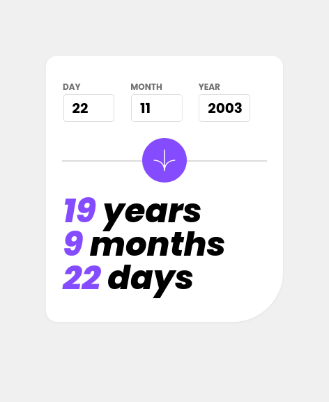

# Frontend Mentor - Age calculator app solution

This is a solution to the [Age calculator app challenge on Frontend Mentor](https://www.frontendmentor.io/challenges/age-calculator-app-dF9DFFpj-Q). Frontend Mentor challenges help you improve your coding skills by building realistic projects.

## Table of contents

- [Overview](#overview)
  - [The challenge](#the-challenge)
  - [Screenshot](#screenshot)
  - [Links](#links)
- [My process](#my-process)
  - [Built with](#built-with)
  - [What I learned](#what-i-learned)
  - [Continued development](#continued-development)
- [Author](#author)

**Note: Delete this note and update the table of contents based on what sections you keep.**

## Overview

### The challenge

Users should be able to:

- View an age in years, months, and days after submitting a valid date through the form
- Receive validation errors if:
  - Any field is empty when the form is submitted
  - The day number is not between 1-31
  - The month number is not between 1-12
  - The year is in the future
  - The date is invalid e.g. 31/04/1991 (there are 30 days in April) (I got leap-years working too!!!)
- View the optimal layout for the interface depending on their device's screen size
- See hover and focus states for all interactive elements on the page
- **Bonus**: See the age numbers animate to their final number when the form is submitted

### Screenshot



### Links

- Solution URL: [here](https://github.com/TheMcnafaha/frontend-mentor-age-calc)
- Live Site URL: [here](https://frontend-mentor-age-calc.vercel.app/)

## My process

### Built with

- Semantic HTML5 markup
- Tailwind
- Flexbox
- Mobile-first workflow
- [React](https://reactjs.org/) - JS library
- [T3](https://create.t3.gg/)
- [Next.js](https://nextjs.org/) - React framework
- [React CountUp ](https://github.com/glennreyes/react-countup)
  **Note: These are just examples. Delete this note and replace the list above with your own choices**

### What I learned

By far, the biggest thing I learned from this challenge was the value of 3rd party libraries. To calcualte the age, I used all custom code. An emberrasing amount of time was spent until I finnally wrote a solution I was happy with. I could've cut the total time this tooke me by half had I just used a library to calcualte the age; so when I wanted to animate the numbers, I googled "react counter animation" before going into any custom code.

For a personal project, writing your own code is a great teaching tool. I will never forget the quirks of JS dates now. And going through the iteritative proccess of creating ever-better (more realistaclly, less-worse) solutions feels great to look back on.

If I had a rigid due date though, even a working solution that only got me 75% of what I needed is wayyy better than hammering my keyboard and hacking away in terms of time-to-deliver.

If there's one topic that I could now drunkenly bring up is this delicious code and the sourrounding, revolutionary, world-descimating theory behind it:

```js
const wholeMonthPivot = {
  year: present.year,
  month: present.month,
  day: DOB.day,
};
```

Oh also, TS with React reducers is no fun. I couldn't get the refactor from _useState_ to _useReducer_ to work without the LSP screaming at me. I ended up by just moving all the logic to a different file.

### Continued development

For the future, I'd like to use a dynamic site. For one, it's what Next is used for. And two, it looks like a fun challenge.

An automatically syncing tierlist sounds fun.

## Author

- Frontend Mentor - [The Mcnafaha](https://www.frontendmentor.io/profile/TheMcnafaha)
